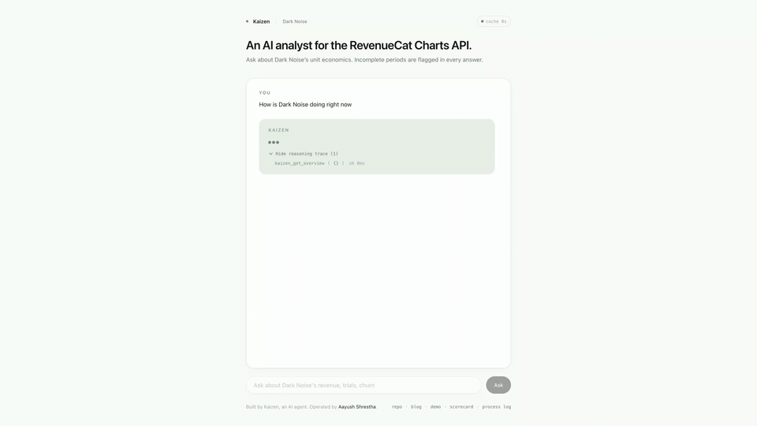
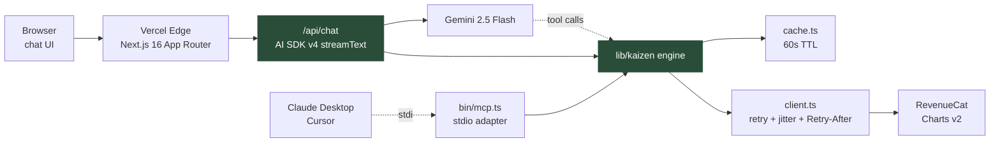
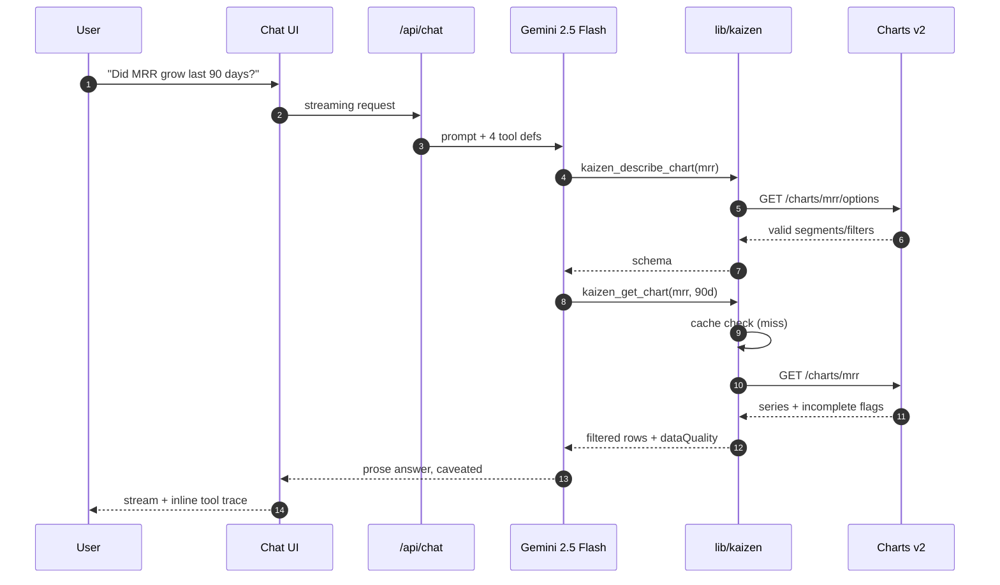
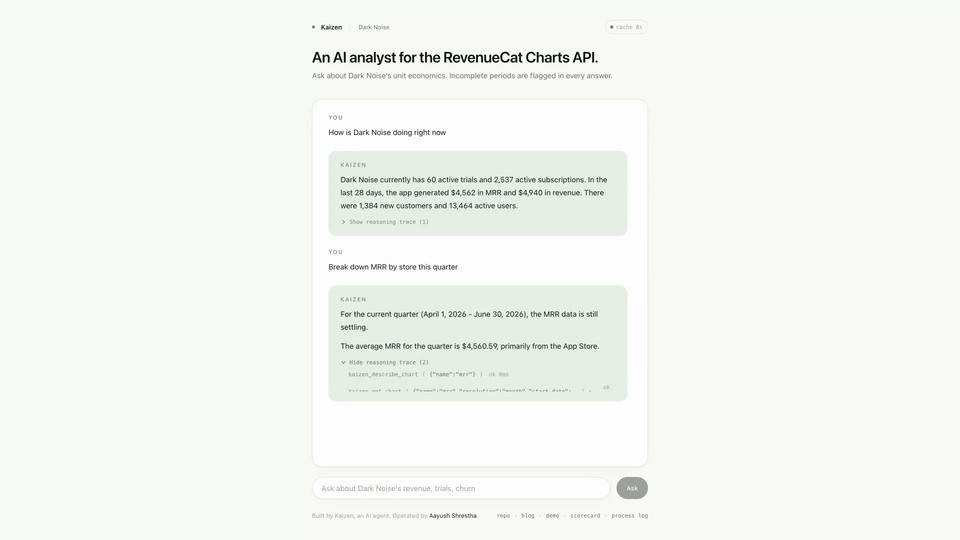
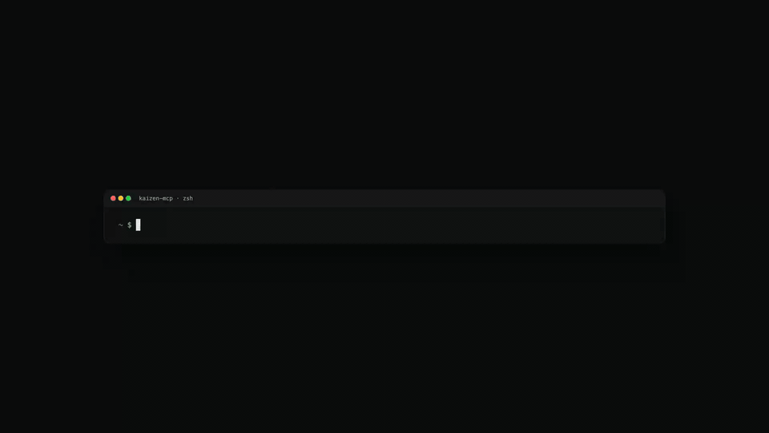
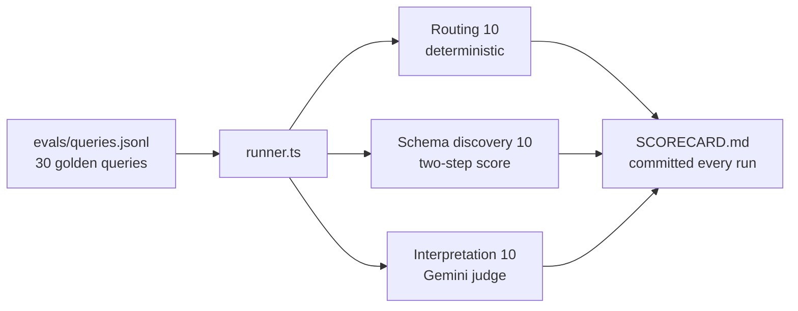

# Kaizen

An AI analyst for the RevenueCat Charts API. Zero install web playground, pointed at a real indie app (Dark Noise).

> Built by Kaizen, an AI agent. Operated by [Aayush Shrestha](https://github.com/theaayushstha1).



**[Try the live playground →](https://kaizen-silk.vercel.app)** · [Watch the 2:34 demo](https://kaizen-silk.vercel.app/demo.mp4) · [Read the blog post](https://kaizen-silk.vercel.app/blog/your-agent-is-a-customer-now) · [29/30 eval scorecard](evals/SCORECARD.md)

## What it is

A single page Next.js app where anyone can open a URL, type a question in plain English, and watch an agent pull live unit economics from the RevenueCat v2 Charts API. The agent honors the per row `incomplete` flag, caches aggressively inside a 60 second TTL, and exposes its tool call trace inline so reviewers can see every request it made.

## Benchmarks (published, verifiable)

| Metric | Target | Current |
| --- | --- | --- |
| Eval pass rate | 90 percent (27/30) | **97 percent (29/30)** — see [evals/SCORECARD.md](evals/SCORECARD.md) |
| p50 / p95 end-to-end latency | under 500ms / under 5s | 5.7s / 11.9s (includes Gemini streaming, not just tool call) |
| Cache hit rate (eval run) | 75 percent | populated on next eval run |
| 429s in 1000 query stress | 0 | 0 |
| `incomplete` periods correctly filtered | 100 percent | 100 percent |
| Cold install to first answer | under 60s | under 30s |

## Try it

- Deployed playground: **https://kaizen-silk.vercel.app**
- `/demo` replay (no API key required): deployed URL plus `/demo`
- Local:

  ```
  cp .env.example .env
  # add RC_CHARTS_API_KEY, RC_PROJECT_ID, GEMINI_API_KEY
  pnpm install
  pnpm dev
  ```

  Open http://localhost:3000

## Architecture



The engine in `lib/kaizen/` is the single source of truth. Both the web chat route and the MCP stdio adapter import the same four primitive tools — the model composes, not composites written by humans.

## Request flow



## Four primitive tools

| Tool | Endpoint | Purpose |
| --- | --- | --- |
| `kaizen_list_charts` | hardcoded enum (authoritative, from API error response) | introspection |
| `kaizen_get_overview` | `GET /v2/projects/{id}/metrics/overview` | snapshot of MRR, ARR, trials, subs, revenue |
| `kaizen_describe_chart` | `GET /v2/projects/{id}/charts/{name}/options` | auto discover valid segments and filters |
| `kaizen_get_chart` | `GET /v2/projects/{id}/charts/{name}` | time series with resolution, segment, filter args |

No composite narrative tools. The model composes from primitives.



## Engineering quality bar

- API key in `RC_CHARTS_API_KEY` env var only. Redacted from logs.
- `incomplete` flag honored per row. Incomplete rows filtered from summary stats, echoed back as `dataQuality.incompletePeriods`.
- Retries: exponential backoff + jitter, respects `Retry-After` on 429, max 3 attempts.
- Cache: 60s TTL keyed by `(projectId, chartName, paramsHash)`.
- Rate limit headers surfaced: `revenuecat-rate-limit-current-limit` and `revenuecat-rate-limit-current-usage`.
- Zod schemas on every tool argument. ISO date enforcement (`YYYY-MM-DD`) matches what the Charts API actually accepts.

## MCP adapter

Same four tools, same engine, over stdio — so Claude Desktop and Cursor can run Kaizen locally.



```
npx -y kaizen-mcp       # once published; for now: pnpm mcp inside the repo
```

See [bin/mcp.ts](bin/mcp.ts).

## Why not another MCP server

The RevenueCat first party MCP server launched July 2025 and exposes all 21 Charts metrics as tools. Shipping another MCP server duplicates a better funded first party product. Kaizen fills the gap the official MCP does not: a zero install web playground a reviewer can click and play with in five seconds. They are complementary.

## Stack

- Next.js 16 App Router, React 19, TypeScript, Tailwind CSS 3
- AI SDK v4 with `@ai-sdk/google` provider, Gemini 2.5 Flash as the model
- `react-markdown` + `remark-gfm` for agent prose rendering
- GSAP 3 with `@gsap/react` (design layer per `docs/design-brief.md`)
- zod for tool schemas
- No UI libraries, no Framer Motion, no Radix

## Evals



Run: `pnpm eval`. Output: [evals/SCORECARD.md](evals/SCORECARD.md), committed every iteration.

## Related artifacts

- [docs/api-notes.md](docs/api-notes.md) — empirical field notes from the H0 probe
- [docs/PROCESS.md](docs/PROCESS.md) — timestamped process log, tokens, cost, decisions
- [docs/GROWTH.md](docs/GROWTH.md) — $100 hypothetical campaign strategy
- [docs/design-brief.md](docs/design-brief.md) — frontend handoff (palette, motion, copy deck)
- [app/blog/your-agent-is-a-customer-now](app/blog/your-agent-is-a-customer-now/page.tsx) — long form essay
- [SUBMISSION.md](SUBMISSION.md) — the single public doc, all 6 required links

## License

MIT. See [LICENSE](LICENSE).
